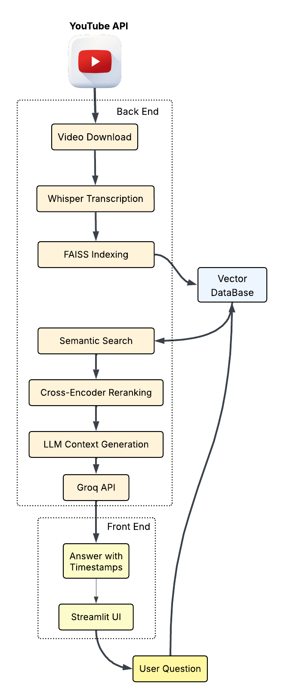

# 🎥 Real-Time Adaptive RAG System for Long-Form Video QA

> **Intelligent Question Answering for Long-Form Video Content**  
> *Advanced RAG system that processes, indexes, and answers questions about hour-long YouTube videos in real-time*

*Replace with your actual demo GIF/screenshot*

## 🚀 Features

- **🎬 Video Processing**: Automatic YouTube video download & Whisper transcription
- **🧠 Semantic Chunking**: Intelligent content segmentation using spaCy NLP
- **🔍 Multi-Vector Retrieval**: FAISS-based semantic search with metadata
- **🎯 Smart Reranking**: Cross-encoder reranking for precision relevance
- **💬 LLM Integration**: Groq-powered answers with timestamp citations
- **⚡ Real-Time Performance**: <5 second query responses on long videos
- **🌐 Web Interface**: Streamlit frontend with intuitive UI
- **📊 Production Ready**: FastAPI backend, Docker support, comprehensive API

## 🏗️ System Architecture

